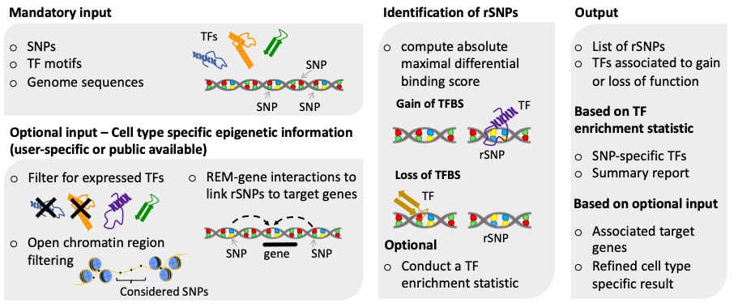

===============
Getting started
===============

SNEEP is fast method to identify regulatory non-coding SNPs (rSNPs) that modify the binding sites of Transcription Factors (TFs) for large collections of SNPs provided by the user. SNEEP combines our statistical approach introduced in our preprint `A statistical approach to identify regulatory DNA variants <https://www.biorxiv.org/content/10.1101/2023.01.31.526404v1>`_ with epigenetic data and additional functionalities.

A graphical summary of SNEEP is shown below:

Installation 
==============

Bioconda package
-----------------

We provide a bioconda package to install the main functionality of our approach. Therefore, an installation of `Bioconda <https://bioconda.github.io/>`_ is needed. 

.. code-block:: console

  conda install sneep

Manual installation
--------------------
If you want to directly install SNEEP, please clone our `GitHub repository <https://github.com/SchulzLab/SNEEP/>`_ and ensure that the following software is available on your machine: 

- c++11 
- g++ (9.3.0)
- python3.x
- bedtools (v2.27.1)
- openmp

To build SNEEP, the following commands are used: 

.. code-block:: console

  cd SNEEP/src/
  make

Please add the path to our software (SNEEP/src) to our PATH environment (otherwise, internally called scrips might not be found).

We tested the code and the Makefile only on a Linux machine. 

Testing your installation 
==========================

We provide a test script to verify if your installation worked. To download the test data and scripts, please clone the latest version of our GitHub repository (if not already done) 

.. code-block:: console

  git clone git@github.com:SchulzLab/SNEEP.git

download our `Zenodo repository <https://doi.org/10.5281/zenodo.4892591>`_ and unzip the files. 

Additionally, a reference genome in FASTA format is needed. The different chromosomes within the file must be named as chr1, chr2. An example is shown below:

.. code-block:: console

  >chr1
  ATCGGGTCA…
  >chr2
  TTTGAGACCAT…

For the provided examples in the following, please use genome version hg38.

To run our tests, please redirect into the SNEEP folder downloaded from GitHub and perform 

.. code-block:: console

  bash runTests.sh <pathToGenome> <pathTodbSNP>  <pathToInteractions>

where <pathTodbSNP> is the path to the dbSNPs_sorted.txt downloaded from our Zenodo repository and  <pathToInteractions> needs to be the path to one of the interaction file, e.g., interactionsREM_PRO_HiC.txt

Basic usage
============

The following 4 files are required as minimal input to run SNEEP:

1)	a file containing the TF motifs in TRANSFAC format, 
2)	a bedlike SNP file or a .VCF file,
3)	a reference genome file in FASTA format,
4) a scale file providing motif-specific scale parameters to compute the significance of the effect of the SNP on the TF (provided).

Minimal example
---------------

To try SNEEP with the minimal required input, ensure that you are in the SNEEP folder and run: 

.. code-block:: console

  differentialBindingAffinity_multipleSNPs examples/combined_Jaspar2022_Hocomoco_Kellis_human_transfac.txt examples/SNPs_EFO_0000612_myocardial_infarction.bed  <path-to-genome-file> necessaryInputFiles/estimatedScalesPerMotif_1.9.txt 

Per default, the result is stored in the directory ‘SNEEP_output’. The file ‘result.txt’ in the SNEEP output directory contains the predicted rSNPs. For more details about the resulting files, see the Section `SNEEP result files <https://sneep.readthedocs.io/en/latest/results.html>`_. The run takes a couple of minutes using one core. 

Detailed description of the required input files
----------------------------------------------------

We obtained human TF motifs from the JASPAR database (version 2022), HOCOMOCO and  Kellis ENCODE database in the required format in the examples directory. Additionally, we provide the mouse motifs from the JASPAR database (version 2022) and the HOCOMOCO database. In general, our approach can be used for any species.

The required bedlike SNP file is a tab-separated file containing the following entries: 

-	chr,
-	start position (0-based),
-	end position (0-based),
-	var1 (e.g., effector allele or alternative allele) ,
-	var2 (e.g., wildtype allele),
-	rsID if known; otherwise - ,
-	minor allele frequency (MAF) if known, otherwise -1. The minor allele frequency is important to provide if you want to assess the result of SNEEP against random controls. Then, SNEEP samples SNPs based on the MAF distribution of the input SNPs. 

An example of a properly formated SNP file can be found below: 

.. code-block:: console

  chr1    109274569       109274570       G       A       rs7528419       0.2009
  chr1    109275907       109275908       C       T       rs646776        0.2384
  chr1    154424939       154424940       G       T       rs12118721      1e-07
  chr1    154424939       154424940       G       T       -      0.3
  chr12   111569951       111569952       G       C       rs653178        -1

If you want to consider a SNP, that has multiple alternative alleles, such as for instance `rs11206510 <https://www.ncbi.nlm.nih.gov/snp/rs11206510>`_ (T -> A,C,G) , please add one line per alternative allele to the bedlike SNP file. An example is shown below: 

.. code-block:: console

  chr1    55030365        55030366        A       T       rs11206510      0.1018
  chr1    55030365        55030366        C       T       rs11206510      0.1018
  chr1    55030365        55030366        G       T       rs11206510      0.1018

Instead of the bedlike formated SNP file also a VCF can be given as input (ending with .vcf or .VCF). For more details of the file format, see `here <https://www.internationalgenome.org/wiki/Analysis/Variant%20Call%20Format/vcf-variant-call-format-version-40/>`_. We expect the first 8 columns to be given, where QUAL and FILTER can be set as ".". If the rsID or the MAF is not known it is als set to ".". An example is shown below: 

.. code-block:: console
##fileformat=VCFv4.0
#CHROM POS     ID        REF ALT    QUAL FILTER INFO
1       154424940       rs12118721      T       C,G     .       .       MAF=1e-07
1       222638065       rs35700460      A       G       .       .       MAF=2e-11
1       222650187       rs17465637      A       C       .       .       
2       202881162       .       T       A       .       .       .

SNEEP can only handle mutations affecting a single base pair (no deletions or insertions). Deletions and insertions are identified by the pipeline and ignored. Additionally, duplicated entries are only considered once.

In the reference genome file, the different chromosomes must be named as chr1, chr2, etc., resulting in the following format: 

.. code-block:: console

  >chr1
  ATCGGGTCA…
  >chr2
  TTTGAGACCAT…

For the provided examples in the following, please use genome version hg38. An already correctly formated file can, for instance, be downloaded from `here <https://hgdownload.soe.ucsc.edu/goldenPath/hg38/bigZips/>`_ filename *hg38.fa.gz*.

For human TF motifs, we provide a file containing motif-specific scale parameters. This information is necessary to determine whether a TF binding site is significantly affected by a SNP. Our modified Laplace distribution is dependent on two parameters, n, which is two times the length of the TF model, and the scale parameter b, which needs to be estimated. For the motif set we provide within our GitHub repository, we also estimated the scale parameter b listed in necessaryInputFiles/estimatedScalesPerMotif_1.9.txt. When a customized TF motif set is used, for instance, for a different species than humans, the scale parameter b needs to be estimated. Therefore, we provide a script XXX (TODO: provide more details here).
